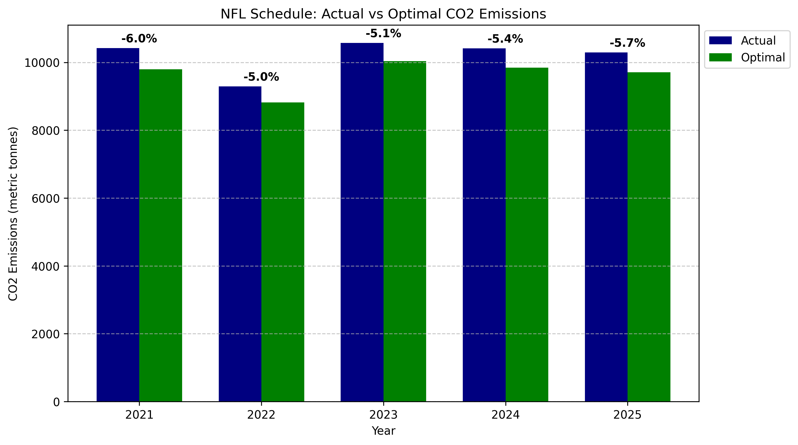

# Sustainable NFL Scheduling Model

The NFL leads all major U.S. sports leagues in terms of carbon footprint per game, primarily due to team travel. This project uses a Binary Integer Programming (BIP) model to generate an NFL season schedule that is most carbon-efficient with respect to travel.

## Results

The chart below compares the total travel-related carbon emissions (in metric tonnes of CO₂) for the actual NFL schedules versus the optimal schedule produced by the model for every applicable year.




## Raw Data

<details>
<summary>Click to expand</summary>

| Year | Actual Schedule<br>(metric tonnes CO₂) | Optimal Schedule<br>(metric tonnes CO₂) | Percentage Decrease<br>(%) |
|------|------------------------------------|-------------------------------------|--------------------|
| 2021 | 10,421.56                          | 9,793.20                            | 6.03               |
| 2022 | 9,290.36                           | 8,823.58                            | 5.02               |
| 2023 | 10,572.54                          | 10,036.19                           | 5.07               |
| 2024 | 10,409.79                          | 9,845.80                            | 5.42               |
| 2025 | 10,294.44                          | 9,706.58                            | 5.71               |

</details>

## How it Works

1. Matchup Algorithm  
   NFL season matchups are determined using the previous season’s in-division rankings of each team and a rotating schedule of divisional matchups. Playwright was used to scrape the official NFL website to obtain these rankings which were fed through an algorithm to generate each season’s matchups.

2. Optimization Model  
   A Binary Integer Programming model was formulated in PuLP and solved using CBC to produce a season schedule that minimizes travel-related carbon emissions.

3. Benchmarking  
   The SportsBlaze API was used to fetch the actual NFL schedules, which were then compared to the optimized schedules to evaluate carbon savings.

The optimal NFL schedule for each year can be found in:

```text
model/output/<year>/<year>_schedule.csv