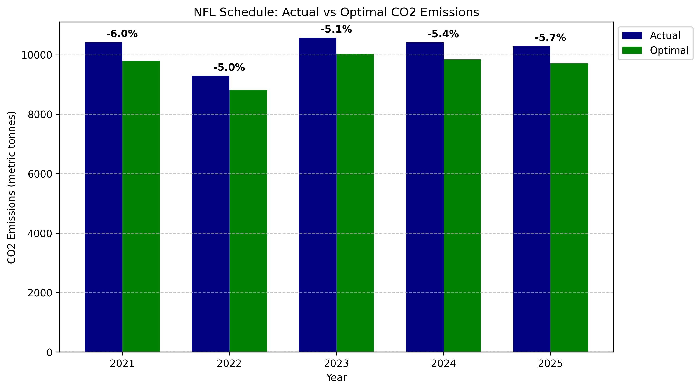

# Sustainable NFL Scheduling Model

The NFL leads all major U.S. sports leagues in carbon footprint per game, primarily due to team travel. This project builds a **Binary Integer Programming (BIP)** model that generates an NFL season schedule minimizing total travel-related carbon emissions — without changing who plays whom, only when and where games are played.

## Results

The chart below compares total travel-related CO₂ emissions (metric tonnes) for the actual NFL schedule versus the carbon-optimal schedule produced by the model, across every applicable year.



<details>
<summary>Raw data</summary>

| Year | Actual Schedule (mt CO₂) | Optimal Schedule (mt CO₂) | Reduction |
|------|--------------------------|---------------------------|-----------|
| 2021 | 10,421.56                | 9,793.20                  | 6.03%     |
| 2022 | 9,290.36                 | 8,823.58                  | 5.02%     |
| 2023 | 10,572.54                | 10,036.19                 | 5.07%     |
| 2024 | 10,409.79                | 9,845.80                  | 5.42%     |
| 2025 | 10,294.44                | 9,706.58                  | 5.71%     |

</details>

The optimized schedules are saved to:

```
model/output/<year>/<year>_schedule.csv
```

## How It Works

### 1. Matchup Generation

NFL matchups are determined by a rotating cross-division schedule combined with each team's prior-season divisional ranking. The model:

- Uses **Playwright** to scrape divisional standings from the official NFL website
- Applies the NFL's scheduling rules to produce the complete set of matchups for the season

### 2. Travel Distance & Emissions Estimation

For each potential game:

- **Nominatim** geocodes each team's headquarters, home stadium, and nearest major airport
- **OSRM** computes road travel distances; the **Haversine formula** computes flight distances
- Distances are converted to CO₂ estimates based on mode of transport (bus, charter flight, etc.)

### 3. Optimization

A BIP model is formulated in **PuLP** and solved with the **CBC** solver to produce an 18-week schedule that minimizes total travel emissions while satisfying all standard NFL scheduling constraints (home/away balance, bye weeks, division play, etc.).

### 4. Comparison Against Actual Schedules

The **SportsBlaze API** retrieves actual NFL schedules. Emissions for the real schedule are computed using the same methodology, then compared against the model's output to quantify savings.

## Project Structure

```
├── model/
│   ├── src/
│   │   ├── geography/        # Geocoding and distance calculations
│   │   ├── matchups/         # Matchup generation and rankings scraper
│   │   └── optimization/     # BIP model
│   ├── data/                 # Intermediate model inputs
│   └── output/               # Optimized schedules by year
├── actual/
│   ├── src/                  # Actual schedule fetching and emissions calculation
│   ├── data/                 # Raw actual schedule data
│   ├── emissions/            # Computed emissions for actual schedules
│   └── schedules/            # Actual NFL schedules by year
└── results/                  # Comparison charts and summary CSV
```

## Tech Stack

| Purpose | Tool |
|---|---|
| Optimization | PuLP + CBC solver |
| Web scraping | Playwright |
| Geocoding | Nominatim |
| Road distances | Project OSRM |
| Flight distances | Haversine formula |
| Schedule data | SportsBlaze API |
